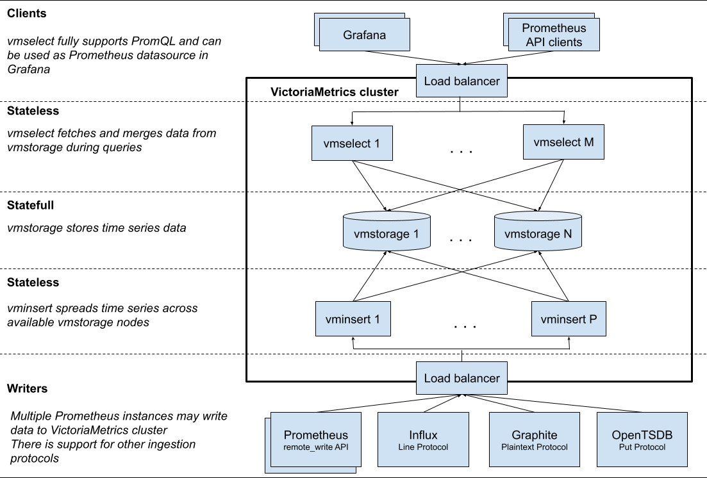
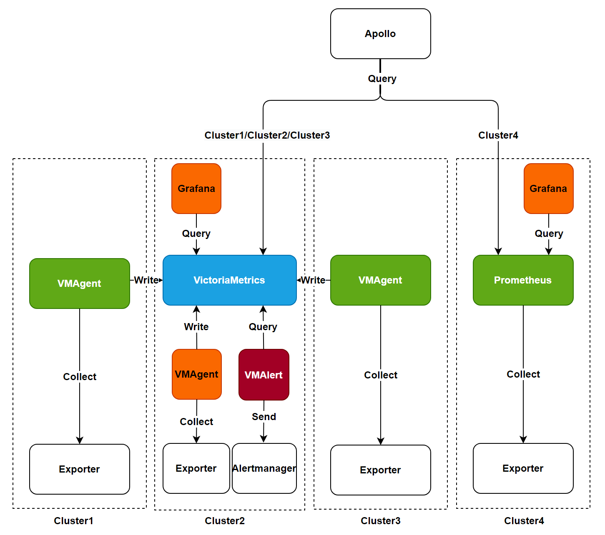

# 监控组件选型指南

在安装集群监控时，平台提供了 VictoriaMetrics 和 Prometheus 两种监控组件供您选择。本文将详细介绍这两种组件的特点和适用场景，帮助您做出最适合的选择。

## 重要说明

- 集群监控组件安装时只能选择 VictoriaMetrics 或 Prometheus 其中之一。
- 从 3.18 版本开始，VictoriaMetrics 已升级至 Beta 版本，具备生产环境使用条件。
- VictoriaMetrics 适合有高可用需求和多集群监控场景。
- Prometheus 适合单集群且规模较小的监控场景。

## 组件清单

### Prometheus 相关组件

| 组件名称         | 功能描述                                                       |
|------------------|--------------------------------------------------------------|
| Prometheus Server | 核心服务器，负责监控数据的采集、存储和查询                  |
| Exporters         | 监控数据采集组件，通过 HTTP 接口暴露监控指标                |
| AlertManager      | 告警管理中心，处理告警规则和通知                              |
| PushGateway       | 支持监控数据的推送模式，用于特殊网络环境下的数据中转         |

### VictoriaMetrics 相关组件

| 组件名称    | 功能描述                                               |
|-------------|------------------------------------------------------|
| VMStorage   | 监控数据存储引擎                                     |
| VMInsert    | 数据写入组件，负责数据分发和存储                     |
| VMSelect    | 查询服务组件，提供数据查询能力                       |
| VMAlert     | 告警规则评估和处理组件                               |
| VMAgent     | 监控指标采集组件                                     |

## 架构对比

### Prometheus 架构

Prometheus 是一个成熟的开源监控系统，是 CNCF 继 Kubernetes 之后的第二个毕业项目。它具有以下特点：

- 强大的数据采集能力。
- 灵活的查询语言 PromQL。
- 完善的生态系统。
- 支持数千节点规模的集群监控。

### VictoriaMetrics 架构

VictoriaMetrics 是新一代高性能时序数据库和监控解决方案，具有以下优势：

- 更高的数据压缩比。
- 更低的资源消耗。
- 原生支持集群高可用。
- 更简单的运维管理。

## 功能对比

| 特性                        | Prometheus              | VictoriaMetrics    | 说明                                                                          |
|-----------------------------|-------------------------|--------------------|--------------------------------------------------------------------------------|
| 高可用安装                  | ❌                      | ✅                  | VictoriaMetrics 支持真正的集群高可用，数据一致性更好                          |
| 单节点安装                  | ✅                      | ✅                  | 两者都支持单节点安装模式                                                        |
| 长期数据存储                | 需要远程存储           | 原生支持           | VictoriaMetrics 更适合长期数据存储                                            |
| 资源效率                    | 较高                   | 更优               | VictoriaMetrics 具有更好的资源利用率                                          |
| 社区支持                    | 非常成熟               | 快速发展           | Prometheus 具有更大的社区生态                                                  |

## 安装方案建议

### 监控安装架构总览

上图展示了平台支持的监控组件安装架构和数据流向。平台提供以下两种安装方式供选择：

**注意**：替换监控组件时，请确保已完全卸载现有组件，且监控数据不支持跨组件迁移。

#### Prometheus 安装方式

该方式对应上图中 **cluster4** 的架构：

- 使用 Prometheus 组件采集和处理监控数据。
- 通过监控面板查询并展示数据。
- 适合单集群场景。

#### VictoriaMetrics 安装方式

VictoriaMetrics 支持以下两种安装模式：

1. **单集群安装模式**
   - 对应上图中 **cluster2** 的架构。
   - 所有 VictoriaMetrics 组件安装在同一集群。
   - 使用 VMAgent 采集数据并写入 VictoriaMetrics。
   - VMAlert 负责告警规则评估。
   - 通过监控面板查询展示数据。

     **提示**：建议数据规模在每秒 100W 以下时使用此模式。

2. **多集群安装模式**
   - 对应上图中 **cluster1/cluster2/cluster3** 的架构。
   - 在业务集群安装 VMAgent 作为数据采集代理。
   - VMAgent 将数据写入中心监控集群的 VictoriaMetrics。
   - 支持多集群统一监控管理。

     **提示**：安装 VMAgent 前需确保已在监控集群中安装 VictoriaMetrics 服务。

### 选择建议

#### 适合使用 VictoriaMetrics 的场景

- **高性能和可扩展性需求**：适合处理高吞吐量数据和长期存储的监控场景。
- **成本效益考虑**：需要优化存储和计算资源成本。
- **高可用需求**：需要监控组件高可用保障。
- **多集群管理**：需要统一管理多个集群的监控数据。

#### 适合使用 Prometheus 的场景

- **单集群小规模**：监控规模较小，无高可用需求。
- **现有 Prometheus 用户**：已有完整的 Prometheus 监控体系。
- **简单稳定需求**：追求简单可靠的监控方案。
- **深度生态集成**：与 Prometheus 生态紧密集成且迁移成本高。
