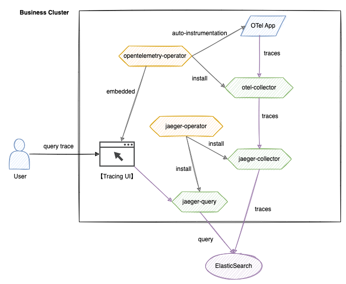

# 架构

本架构基于 OpenTelemetry 和 Jaeger 技术栈构建，实现分布式调用链的全生命周期管理。系统包含数据采集、传输、存储、查询和可视化五大核心模块。

## 核心组件

1. **OpenTelemetry 体系**
   - **opentelemetry-operator**  
     集群级 Operator，负责部署与管理 otel-collector 组件，并提供 OTel 自动注入能力。
   - **otel-collector**  
     接收来自应用程序的追踪数据，进行过滤、批处理后转发至 jaeger-collector。
   - **调用链 UI**  
     集成 jaeger-query API 的自研可视化界面，支持多维查询条件。

2. **Jaeger 体系**
   - **jaeger-operator**  
     部署与管理 jaeger-collector 和 jaeger-query 组件。
   - **jaeger-collector**  
     接收 otel-collector 转发处理后的调用链数据，进行格式转换后写入 Elasticsearch。
   - **jaeger-query**  
     提供调用链查询 API，支持 TraceID、标签等多条件检索。

3. **存储层**
   - **Elasticsearch**  
     分布式存储引擎，支持海量 Span 数据的高效写入与检索。

## 数据流程

- **写入流程**  
  `应用程序 -> otel-collector -> jaeger-collector -> Elasticsearch`
  
  应用通过 SDK 或自动注入生成 Span 数据，经 otel-collector 标准化处理后，由 jaeger-collector 持久化到 Elasticsearch。

- **查询流程**  
  `用户 -> 调用链 UI -> jaeger-query -> Elasticsearch`
  
  用户通过 UI 提交查询条件，jaeger-query 从 Elasticsearch 检索数据，UI 根据返回结果进行可视化展示。
