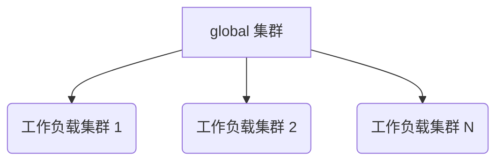

# 架构

## 概述

Alauda 容器平台 (<Term name="productShort" />) 的架构旨在提供一个强大、可扩展和灵活的云原生基础设施解决方案。本文件概述了构成我们平台基础的核心架构原则、集群类型和设计考虑。

## 架构概念

### `global` 集群

`global` 集群是 Alauda 容器平台的中枢神经系统。它作为整个平台的主要管理和控制层，负责：

- 全平台范围的集群管理
- 租户管理和访问控制
- 全局调度和编排
- 平台级配置和策略执行
- 生态系统的监控和可观察性

`global` 集群的主要特征包括：

- 专用的物理资源
- 与工作负载处理隔离
- 集中的管理能力
- 高可用性和安全配置

### 工作负载集群

**工作负载集群** 是设计用于托管和运行实际应用程序和服务的执行环境。这些集群是：

- 专用于运行应用程序工作负载
- 具备横向扩展能力
- 在不同基础设施类型之间灵活
- 由 `global` 集群管理和编排

## 架构设计原则

### 1. 控制平面隔离

架构规定 `global` 集群与工作负载集群之间需严格分离：

- `global` 集群使用专用的物理资源
- 避免资源争用和性能下降
- 确保平台管理的稳定性和安全性

### 2. 操作灵活性

<Term name="productShort" /> 支持多种操作场景：

- 完全分离的 `global` 和工作负载集群（推荐用于生产环境）
- 用于开发和资源受限环境的共置配置
- 混合云和多云架构

### 3. 集群访问与管理

工作负载集群集成的两种主要方法：

a) **创建新的工作负载集群**

- 推荐的方法
- 完全由 `global` 集群管理
- 一致的配置和合规性
- 简化的生命周期管理

b) **连接现有集群**

- 支持连接预先存在的 Kubernetes 集群
- 需要进行版本和兼容性检查
- 标准化的访问和管理协议

## 架构可视化

## 此架构的主要优势

- **增强的安全性**：控制面和执行面隔离
- **可扩展性**：轻松添加新的工作负载集群
- **灵活性**：支持多样化的基础设施环境
- **效率**：集中管理与分布式处理
- **合规性**：跨集群一致的策略执行

## 架构考虑

在规划 <Term name="productShort" /> 架构时，请考虑：

- 基础设施多样性
- 可扩展性需求
- 合规性与安全需求
- 应用工作负载特性
