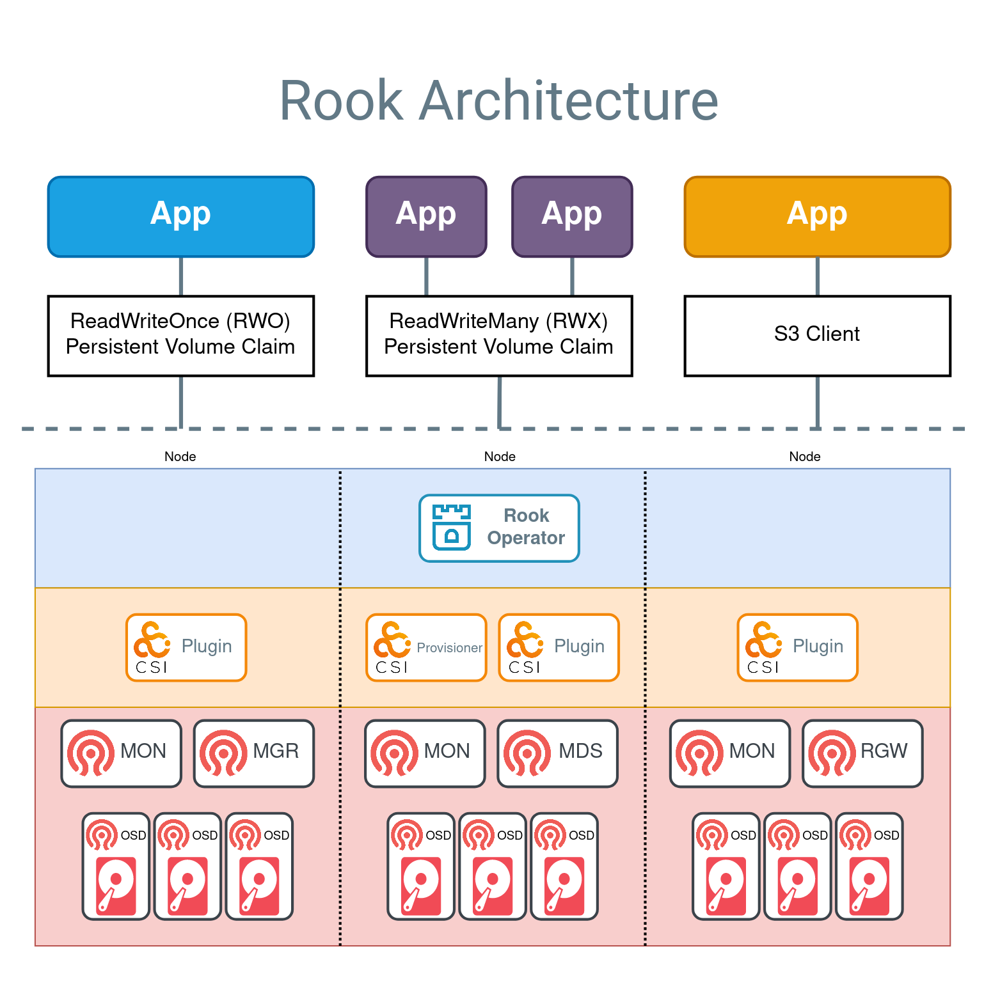

# 架构

## 技术架构

上面展示了三种存储类型的示例应用程序：

- 块存储通过一个蓝色应用表示，该应用挂载了一个支持 ReadWriteOnce（RWO）的存储卷。应用程序可以读写 RWO 卷，而 Ceph 管理 IO 操作。
- 共享文件系统由两个紫色应用表示，它们共同使用一个支持 ReadWriteMany（RWX）的存储卷。两个应用程序可以同时主动读取或写入该卷。Ceph 将通过 MDS 守护进程确保数据在多个写入者的情况下得到安全保护。
- 对象存储通过一个橙色应用来体现，该应用可以使用标准的 S3 客户端对存储桶进行读写操作。

在上述图表中，虚线以下的部分可以分为三大类：

- [Rook Operator](./concepts/concept.mdx#rook-operator)（蓝色层）：Operator 负责自动配置 Ceph。
- [CSI 插件和 Provisioner](./concepts/concept.mdx#ceph-csi)（橙色层）：Ceph-CSI 驱动负责卷的供应和挂载。
- [Ceph 守护进程](./concepts/concept.mdx#ceph-module-functions)（红色层）：Ceph 守护进程运行核心存储架构。

**块存储**\
在上图中，创建一个带有 RWO 卷的应用程序的流程如下：

- （蓝色）应用程序创建 PVC 以请求存储。
- PVC 定义了 Ceph RBD 存储类（sc）以供应存储。
- Kubernetes 调用 Ceph-CSI RBD Provisioner 创建 Ceph RBD 镜像。
- Kubelet 调用 CSI RBD 卷插件将卷挂载到应用程序中。
- 卷现在可用于读写操作。
- 一个 ReadWriteOnce 卷一次只能挂载到一个节点上。

**共享文件系统**\
在上图中，创建一个带有 RWX 卷的应用程序的流程如下：

- （紫色）应用程序创建 PVC 以请求存储。
- PVC 定义了 CephFS 存储类（sc）以供应存储。
- Kubernetes 调用 Ceph-CSI CephFS Provisioner 创建 CephFS 子卷。
- Kubelet 调用 CSI CephFS 卷插件将卷挂载到应用程序中。
- 卷现在可用于读写操作。
- 一个 ReadWriteMany 卷可以挂载到多个节点上，供应用程序使用。

**对象存储 S3**\
在上图中，创建一个可以访问 S3 存储桶的应用程序的流程如下：

- （橙色）应用程序创建 BucketClaim 以请求存储桶。
- Ceph COSI Driver 创建 Ceph RGW 存储桶。
- Ceph COSI Driver 创建一个包含访问存储桶凭据的 Secret。
- 应用程序从 Secret 中获取凭据。
- 应用程序现在可以使用 S3 客户端对存储桶进行读写操作。
