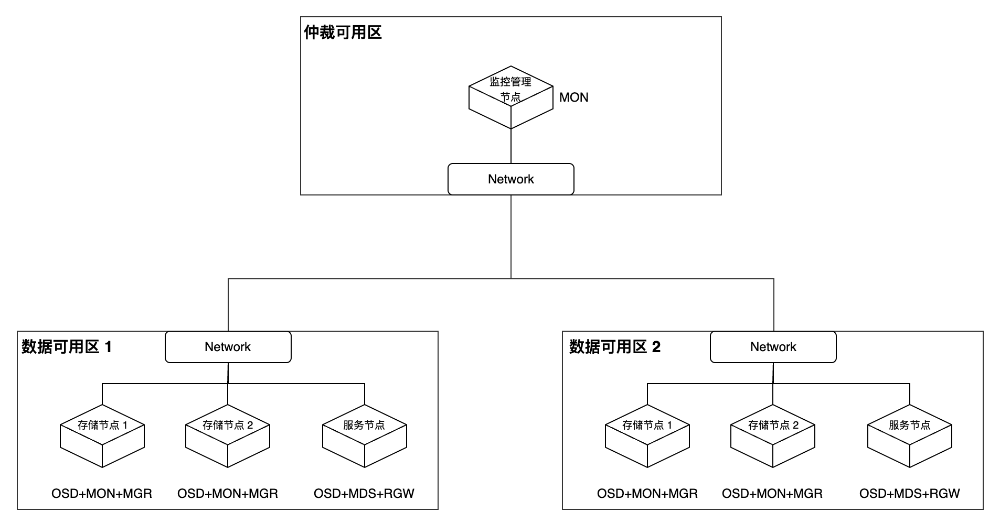

# 创建存储服务-创建延伸类型集群

延伸类型的集群能够在两个地理位置不同的区域进行扩展，为存储基础设施提供灾难恢复的能力。灾难发生时，当两个数据可用区中的一个可用区完全不可用，Ceph 依然可以保持可用性。

## 名词解释

|名词|解释|
|---|---|
|**MON（Monitor，监视器）**|主要用于维护集群状态图（Cluster Map），记录集群成员、配置和状态信息，处理集群成员认证，参与仲裁投票。|
|**OSD（Object Storage Daemon，对象存储守护进程）**|主要用于管理物理存储设备，处理数据复制、恢复和再平衡，与其他 OSD 通信以确保数据一致性，向监视器报告状态。|
|**MGR（Manager，管理器）**|负责跟踪运行时指标和集群状态，提供额外的监控和接口功能，管理集群的各种资源（包括存储利用率、当前负载等），并提供仪表板界面以便于管理员监控和管理集群。|
|**MDS（Metadata Server，元数据服务器）**|主要用于管理 CephFS 文件系统的元数据，维护文件系统目录结构，管理文件权限和属性，提供 POSIX 兼容的文件系统接口。|
| **RGW（RADOS Gateway，对象存储网关）**|主要用于提供 S3 和 Swift 兼容的 RESTful API，处理对象存储请求，管理用户认证和访问控制，支持多租户隔离。|
|**仲裁可用区**|通常位于独立的区域，不承载主要业务负载，专注于维护集群的一致性，主要用于在主数据中心发生故障或网络分区时进行仲裁决策。|
|**数据可用区**|是 Ceph 集群中实际存储和处理数据的主要区域，承载业务负载和数据存储任务，与仲裁区共同构成了一个完整的高可用存储系统。|

## 典型部署方案

下述内容提供了延伸类型集群的典型部署方案，并提供了组成说明及故障恢复的原理说明。

### 组成说明

节点需要划分在三个可用区中，包括两个数据可用区和一个仲裁可用区。

* 两个数据可用区均需要完整部署所有 Ceph 核心组件（MON、OSD、MGR、MDS、RGW），且每个数据可用区必须配置两个 MON 实例以实现高可用。当同一数据可用区内的两个 MON 实例均不可用时，系统将判定该可用区为异常状态。

* 仲裁可用区仅需部署一个 MON 实例，作为仲裁决策节点。

### 故障恢复说明

* 当某个数据可用区完全故障时，Ceph 集群将自动进入降级状态并触发告警通知，系统会将存储池的最小副本数（min_size）从默认的 2 调整为 1，由于另外一个数据可用区内依然维持双副本运行，此时集群状态为可用。当故障的数据可用区恢复后，系统会自动执行数据同步并恢复至健康状态；如果故障无法修复，则建议使用新的数据可用区进行替换。

* 当两个数据可用区之间的网络连接中断，但它们均可正常连接至仲裁可用区时，仲裁可用区将基于预设策略对两个数据可用区进行仲裁，并选择状态更优的一方作为主数据区继续提供服务。

## 约束与限制

* **存储池限制**：不支持纠删码存储池，只能使用副本机制进行数据保护。

* **设备分类限制**：不支持设备类功能，无法按设备特性进行存储分层。

* **区域部署限制**：仅支持存在两个数据可用区，不能存在两个以上的数据可用区。

* **数据均衡要求**：两个数据可用区的 OSD 权重必须严格保持一致，以确保数据分布的均衡性。

* **存储介质要求**：必须使用全闪存（All-Flash）OSD 配置，可最小化在连接恢复后恢复所需的时间，并尽可能减少数据丢失的可能性。

* **网络延迟要求**：两个数据可用区之间的 RTT（往返延迟）不能超过 10ms，仲裁可用区需要满足 ETCD 规范的延迟要求，以确保仲裁机制的可靠性。

## 前提条件\{#pre}

请提前将集群中的全部或部分节点划分至三个可用区中，要求如下：

* 请确保至少有 5 个节点分布在一个仲裁可用区及两个数据可用区中。其中，仲裁可用区至少存在一个节点，可以使用虚拟机或云主机。

* 请确保三个可用区中至少有一个可用区存在 Master 节点（控制节点）。

* 请确保至少有 4 个计算节点均匀分布在 2 个数据可用区中，且每个数据可用区中至少配置 2 个计算节点。
* 请尽量保证两个数据可用区的节点数量和磁盘配置一致。

## 操作步骤

### 为节点添加标签

1. 进入 **平台管理**。

1. 在左侧导航栏中，单击 **集群管理** > **集群**。

2. 单击相应集群名称进入集群概览页面。

3. 切换至 **节点** 页签。
4. 根据 [前提条件](#pre) 中的规划，分别为这些节点添加 `topology.kubernetes.io/zone=<zone>` 标签，即可将节点划分至指定的可用区。其中，需使用可用区的名称替换 \<zone> 部分。

### 创建存储服务

本文档中仅介绍与标准类型集群不同的参数，其他参数请参考 [创建存储服务-创建标准类型集群](./create_service_stand.mdx)。

**创建集群**

|参数|说明|
|---|---|
|**集群类型**|选择 **延伸**。|
|**仲裁可用区**|选择仲裁可用区的名称。|
|**数据可用区**|选择可用区名称，并选择节点。|

**创建存储池**

|参数|说明|
|---|---|
|**副本数量**|默认为 4。|
|**实例数量**|当存储类型为 **对象存储** 时，为保证可用性，实例数最小值为 2，最大不超过5。|

## 相关操作

### 创建标准类型集群

具体说明请参考 [创建存储服务-创建标准类型集群](./create_service_stand.mdx)。
