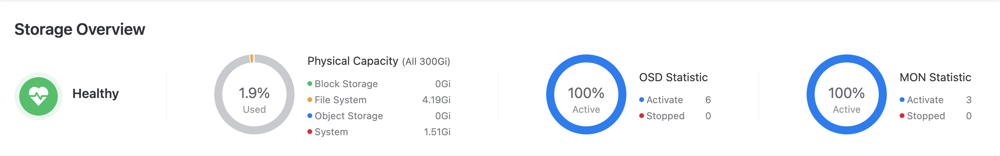
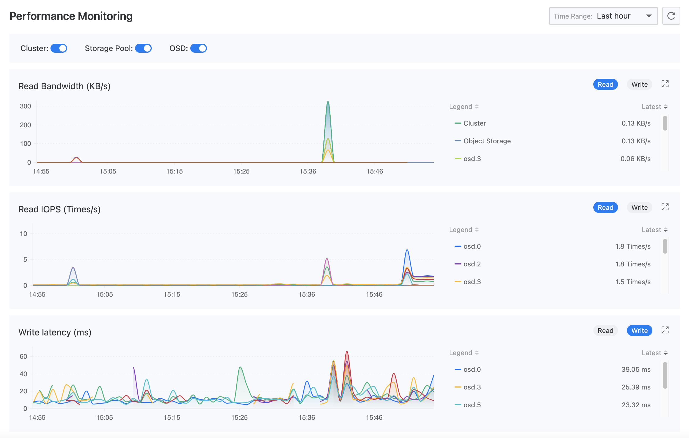
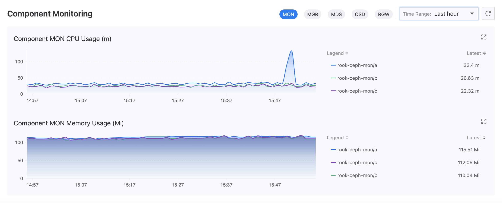
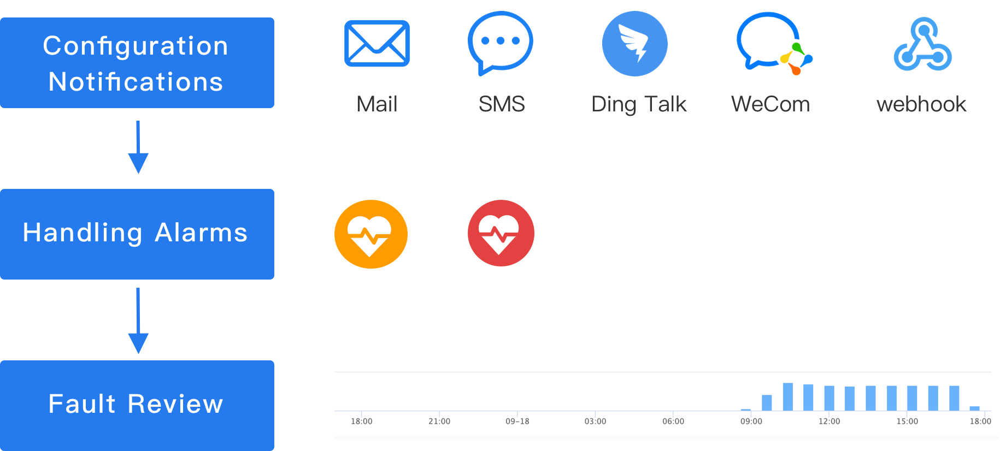

# 监控与告警

分布式存储提供了开箱即用的监控指标采集和告警提醒能力。启用监控与告警功能后，可从存储集群、存储性能及存储组件等方面进行监控和告警，且支持配置通知策略。

直观呈现的监控数据可用于为运维巡检或性能调优提供决策支持，完善的告警和通知机制也将帮助保障存储系统的稳定运行。

**提示**：如果创建分布式存储时未启用监控与告警功能，您只能另行寻找存储监控与告警的替代方案。例如，在运维中心手动配置监控面板和告警策略。

## 监控

平台默认会收集分布式存储的读写性能、CPU 及内存使用量等常用监控指标。在 **存储管理** > **分布式存储** 的 **监控** 页签中，可查看指标的实时监控数据。

### 存储概览

监控存储的健康状态、物理容量使用情况以及 OSD/MON 组件活动数，存储状态异常时可查看告警原因。

### 性能监控
从集群、存储池及 OSD 三个维度监控读写带宽和读写 IOPS；同时，针对 OSD 还可监控读写延迟。

### 组件监控
监控 MON、OSD 等组件的 CPU 使用量和内存使用量。

## 告警

平台默认启用了一批告警策略，一旦资源异常或监控数据达到预警状态，将自动触发告警。预置策略已能满足组件和集群状态告警、设备容量告警，以及用户数据告警等常见运维需求。

### 配置通知

为了能及时收到告警，建议您在运维中心设置通知策略：将告警信息以邮件、短信等方式发送给相关人员，提醒其采取必要的措施解决问题或避免故障发生。单击   可切换至运维中心完成操作，参考 [创建告警策略]()。

### 处理告警

* 若监控到存储集群为 `告警` 状态，表示当前已触发告警，且相关异常可能导致故障。请及时查看 **实时告警** 详情，并结合故障原因定位及排障。

* 若监控到存储集群为 `故障` 状态，表示存储集群已无法正常运行。请立即定位问题并排障。

下表为预置策略所用告警等级的含义，可作为您制定告警处理原则的参考。

|告警等级| 含义                                                  |
| -------- | ------------------------------------------------------------ |
|**灾难**| 告警规则对应的资源发生故障，导致平台业务中断、数据丢失，影响程度重大。 |
|**严重**| 告警规则对应的资源存在已知问题，可能导致平台功能故障，影响业务正常运行。 |
|**警告**| 告警规则对应的资源存在运行风险，如不及时处理，可能影响业务正常运行。 |

### 故障复盘

**告警历史** 中记录了所有曾经触发，当前已无须处理的告警。借助告警历史进行故障复盘时，为了能有效地达到经验总结目的，您可能需要回答以下问题。

* 事故发生时，具体的异常情况是什么？

* 告警列表中某条告警反复出现，是否有规律可循？能否在下次发生之前提前避免？

* 时间轴显示某个时段告警激增，是不可抗力导致还是运维事故？是否需要调整运维方案？