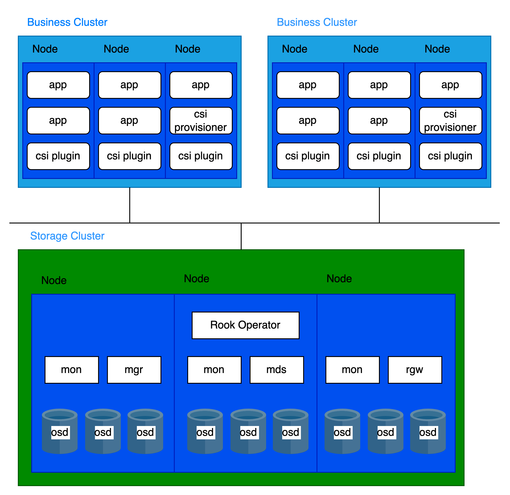
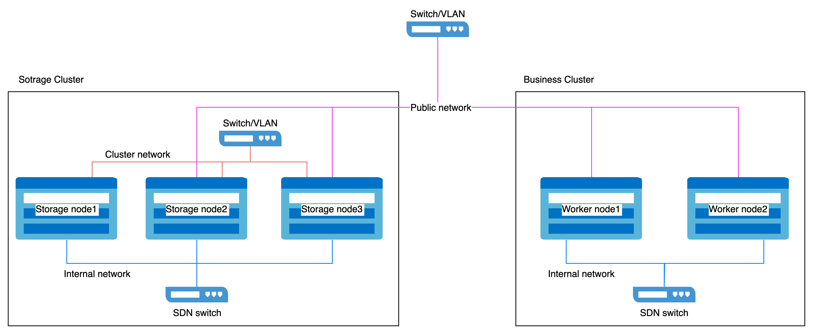

# 使用专用集群部署分布式存储 

专用集群部署是指使用一个独立的集群来部署平台的分布式存储，平台内的其他业务集群通过接入来访问和利用它提供的存储服务。
为了保证平台分布式存储的性能和稳定性，只将平台核心组件和分布式存储组件部署在专用存储集群中，避免了其他业务工作负载的共置。这种分离部署方法是平台分布式存储的最佳实践。

## 架构  

存算分离架构

  


## 基础架构要求  

### 平台要求   

仅支持 3.18 及以上版本。

### 集群要求   

推荐使用裸金属集群来作为专用存储集群。

### 资源要求   

分布式署存储的组成部分请参考[核心概念](../concepts/concept.mdx)

每个组件都有不同的 CPU 和 Memory 需求，推荐配置如下：

|程序|CPU|Memory|
|:---|:---:|:---:|
|MON|2c|3Gi|
|MGR|3c|4Gi|
|MDS|3c|8Gi|
|RGW|2c|4Gi|
|OSD|4c|8Gi|


一个集群的组件运行情况如下：  
- 3 个 MON
- 2 个 MGR  
- 多个 OSD
- 2 个 MDS (如果使用 CephFS)
- 2 个 RGW (如果使用 Ceph 对象存储) 


基于组件分布，集群中每个节点的资源建议如下：   

|CPU|Memory|
|:---|:---|
|16c + (4c * 节点 OSD 个数)|20Gi + (8Gi * 节点 OSD 个数)|  

### 存储设备要求   

建议每个节点低于 12 个存储设备。这有助于限制节点故障后的恢复时间。

#### 存储设备类型要求    

推荐使用企业级 SSD，单个容量不超过 10TiB，并且确保所有硬盘容量和类型一致。  

#### 容量规划   

在部署之前，需要根据实际业务的需求来规划容量。默认情况下，分布式存储使用 3 副本的冗余策略。因此，可用容量是所有硬盘总容量的 3 分之 1。 

以30(N)个节点（replica count = 3）为例，可用容量场景如下：  
|存储设备容量(D)|节点上存储设备个数(M)|总容量(D*M*N)|可用容量(D*M*N/3)|
|:---:|:---:|:---:|:---:|
|0.5 TiB|3|45 TiB|15 TiB|
|2 TiB|6|360 TiB|120 TiB|
|4 TiB|9|1080 TiB|360 TiB|

#### 容量监控和扩容  

1. **主动容量规划**  

    始终确保可用存储容量超过消耗量。如果存储完全耗尽，恢复需要手动干预，无法通过简单删除或迁移数据来解决。

2. **容量告警**  

    集群会在两个阈值触发告警：  

    - **80% 使用率** ("near full"): 需要主动 **释放空间** 或者进行集群扩容。
    - **95% 使用率** ("full"): 存储已完全耗尽，且标准命令无法释放空间。请立即联系平台支持团队。  

    务必及时处理警报，并定期监控存储使用情况，以避免服务中断。  

3. **扩容推荐**  

    - **避免**: 为已有节点添加存储设备来扩容。
    - **推荐**: 通过添加新的存储节点来扩容。
    - **要求**: 新增节点必须使用与现有节点相同大小、类型和数量的存储设备。  

### 网络要求  

分布式存储必须使用 **主机网络**.   

#### 网络隔离    

网络分为两种类型:

    - **公共网络**: 用于客户端与存储组件进行交互 (e.g., 业务 I/O 请求).
    - **集群网络**: 专门用于副本之间的数据复制和数据再平衡 (e.g., recover、 backfill).

为了确保服务质量和性能稳定:

1. 对于存储专用集群:  
    每台主机预留 2 个网口:
        - 公共网络: 用于客户端和组件通信。
        - 集群网络: 用于内部复制和数据均衡。
2. 对于业务集群:  
    在每台主机上预留一个网口用于访问存储公共网络。

网络隔离配置示例  

  

#### 网络接口速度要求    

1. **存储集群节点**  
    - **公共网络** 和 **集群网络** 要求 10GbE 或以上的网络接口.  

2. **业务集群节点**  
    - 用于访问存储 **公共网络** 要求 10GbE 或以上的网络接口。


## 操作步骤    

<Steps>
### 部署 Operator  

1. 进入 **平台管理**。

1. 在左侧导航栏中，单击 **存储管理** > **分布式存储**。

3. 单击 **立即配置**。

4.  在 **部署 Operator** 向导页中，单击右下角 **部署 Operator** 按钮。  
      
    - 待页面自动进入下一步时，说明 Operator 部署成功。        
        
    - 如果部署失败，请参考界面提示 **清理已部署信息并重试**，重新部署 Operator；若您想返回分布式存储选择页，请单击 **应用商店**，首先卸载已经部署 **rook-operator** 内的资源实例，再卸载 **rook-operator**。


### 创建 Ceph 集群  

在存储集群的 **控制节点** 执行命令。
<details> 
    <summary>点击查看</summary>

    ```yaml
    cat << EOF | kubectl create -f -
    apiVersion: ceph.rook.io/v1
    kind: CephCluster
    metadata:
      name: ceph-cluster
      namespace: rook-ceph
    spec:
      cephConfig:
        global:
          mon_memory_target: "3221225472"
          mds_cache_memory_limit: "8589934592"
          osd_memory_target: "8589934592"
          bluefs_buffered_io: "false"
        mon:
          auth_allow_insecure_global_id_reclaim: "true"
          mon_warn_on_insecure_global_id_reclaim: "false"
          mon_warn_on_insecure_global_id_reclaim_allowed: "false"
      cephVersion:
        image: build-harbor.alauda.cn/3rdparty/ceph/ceph:v18.2.4-0
      dashboard:
        enabled: true
      dataDirHostPath: /var/lib/rook
      mgr:
        count: 2
        modules:
        - enabled: true
          name: pg_autoscaler
      mon:
        count: 3
      monitoring:
        enabled: true
      network:
        ipFamily: IPv4
        addressRanges:
          public:
          - <public network cidr>
          cluster:
          - <cluster network cidr>
        provider: host
      placement:
        all:
          tolerations:
          - effect: NoSchedule
            operator: Exists
          - key: "node-role.kubernetes.io/master"
            operator: "Exists"
            effect: "NoSchedule"
          - key: "node-role.kubernetes.io/control-plane"
            operator: "Exists"
            effect: "NoSchedule"
          - key: "node-role.kubernetes.io/cpaas-system"
            operator: "Exists"
            effect: "NoSchedule"
        mgr:
          podAffinity:
            podAntiAffinity:
              requiredDuringSchedulingIgnoredDuringExecution:
              - labelSelector:
                  matchExpressions:
                  - key: app
                    operator: In
                    values:
                    - rook-ceph-mgr
                  topologyKey: kubernetes.io/hostname
      priorityClassNames:
        all: system-node-critical
      resources:
        crashcollector:
          limits:
            cpu: 200m
            memory: 128Mi
          requests:
            cpu: 100m
            memory: 64Mi
        mgr:
          requests:
            cpu: "3"
            memory: 4Gi
        mon:
          requests:
            cpu: "2"
            memory: 3Gi
        osd:
          requests:
            cpu: "4"
            memory: 8Gi
      storage:
        <storage devices>
    EOF
    ```
</details>

**参数**:  
- **public network cidr**: 存储 **公共网络** 的 CIDR （e.g., ```- 10.0.1.0/24```）.
- **cluster network cidr**: 存储 **集群网络** 的 CIDR （e.g., ```- 10.0.2.0/24```）.
- **storage devices**: 指定分布式存储使用的存储设备。   
    格式样例:
    ```         
      nodes:
      - name: storage-node-01
        devices:
        - name: /dev/disk/by-id/wwn-0x5000cca01dd27d60
        useAllDevices: false
      - name: storage-node-02
        devices:
        - name: sdb
        - name: sdc
        useAllDevices: false
      - name: storage-node-03
        devices:
        - name: sdb
        - name: sdc
        useAllDevices: false
    ```  
    <Directive type="info" title="Tip">
    使用磁盘的WWN （World Wide Name）进行稳定命名，避免依赖重启后可能发生变化的 `sdb` 等易失性设备路径。
    </Directive>

### 创建存储池  

存储池有三种类型。根据您的业务需求选择并创建。

#### 创建文件存储池  

在存储集群的 **控制节点** 执行命令。  
<details> 
    <summary>点击查看</summary>

    ```yaml
    cat << EOF | kubectl apply -f -
    apiVersion: ceph.rook.io/v1
    kind: CephFilesystem
    metadata:
      name: cephfs
      namespace: rook-ceph
    spec:
      metadataPool:
        failureDomain: host
        replicated:
          requireSafeReplicaSize: true
          size: 3
      dataPools:
      - failureDomain: host
        replicated:
          requireSafeReplicaSize: true
          size: 3
      preserveFilesystemOnDelete: false
      metadataServer:
        activeCount: 1
        activeStandby: true
        placement:
          podAntiAffinity:
            requiredDuringSchedulingIgnoredDuringExecution:
            - labelSelector:
                matchExpressions:
                - key: app
                  operator: In
                  values:
                  - rook-ceph-mds
              topologyKey: kubernetes.io/hostname
          tolerations:
          - effect: NoSchedule
            operator: Exists
        resources:
          requests:
            cpu: "3"
            memory: 8Gi
    EOF
    ```
</details>  

#### 创建块存储池  

在存储集群的 **控制节点** 执行命令。  
<details> 
    <summary>点击查看</summary>

    ```yaml
    cat << EOF | kubectl apply -f -
    apiVersion: ceph.rook.io/v1
    kind: CephBlockPool
    metadata:
      name: block
      namespace: rook-ceph
    spec:
      failureDomain: host
      replicated:
        size: 3
    EOF
    ```
</details>

#### 创建对象存储池  

在存储集群的 **控制节点** 执行命令。  
<details> 
    <summary>点击查看</summary>

    ```yaml
    cat << EOF | kubectl apply -f -
    apiVersion: ceph.rook.io/v1
    kind: CephObjectStore
    metadata:
      name: object
      namespace: rook-ceph
    spec:
      metadataPool:
        failureDomain: host
        replicated:
          requireSafeReplicaSize: true
          size: 3
      dataPool:
        failureDomain: host
        replicated:
          requireSafeReplicaSize: true
          size: 3
      preservePoolsOnDelete: false
      gateway:
        instances: 2
        placement:
          podAntiAffinity:
            requiredDuringSchedulingIgnoredDuringExecution:
            - labelSelector:
                matchExpressions:
                - key: app
                  operator: In
                  values:
                  - rook-ceph-rgw
              topologyKey: kubernetes.io/hostname
          tolerations:
          - effect: NoSchedule
            operator: Exists
        port: 7480
        resources:
          requests:
            cpu: "2"
            memory: 4Gi
    EOF
    ```
</details>

</Steps>

## 相关操作  

当其他集群需要使用分布式存储服务时，请参考以下指导。    
[接入存储服务](/storage/storagesystem_ceph/functions/access_storage_service.mdx)
