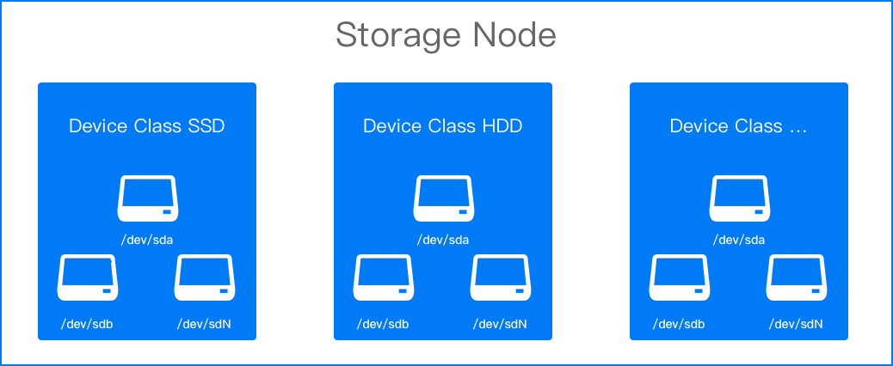

# 设备管理

无论是初次部署或资源扩容，您都需要将节点上的可用磁盘映射成存储设备来使用和管理。

同样特性的存储设备通常会被集中使用，本地存储中将这些设备归入 **设备类**。使用设备类与直接使用磁盘无差异，仍然能保证零损耗和高性能，同时也会降低应用对具体某个设备的感知和依赖。

## 前提条件

* 已经在创建本地存储集群时添加至少 1 个  [设备类（deviceClasses.classes）](/storage/storagesystem_topolvm/installation.mdx)，设备类中需包括设备。

* 节点上至少存在 1 块裸盘。

## 添加设备

1. 进入 **平台管理**。

1. 在左侧导航栏中，单击 **存储管理** > **本地存储**。

3. 在 **详细信息** 页签中，单击 **添加存储节点**。
4. 参考以下说明配置相关参数。

    
    |参数| 说明     |
    | -------- | -----  | 
    | **存储节点**   | 指至少具备 1 块裸盘的节点。 |
    | **设备类**  | 每个设备类对应一组相同特性的存储设备，建议根据磁盘性质填写名称，例如 *hdd*、*ssd*。|
    | **存储设备**   | 例如 */dev/sda*。如有多个盘，可逐个添加。     <b>注意</b>：存储设备应是整个硬盘而不是硬盘上的分区，否则会出现错误。|
    
4. 单击 **添加**。

    **说明**：如果因为还未添加设备导致设备类状态为 `不可用`，继续往下操作即可。

3. 切换到 **存储设备** 页签，单击 **添加存储设备**。
4. 根据界面提示添加设备。
6. 单击 **添加**。  

