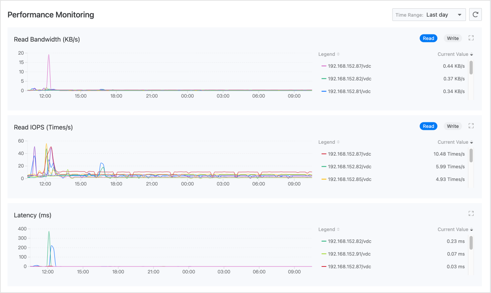
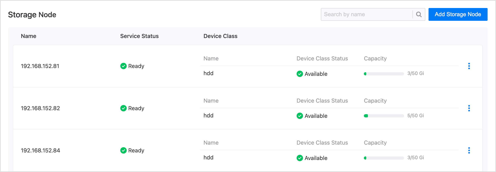
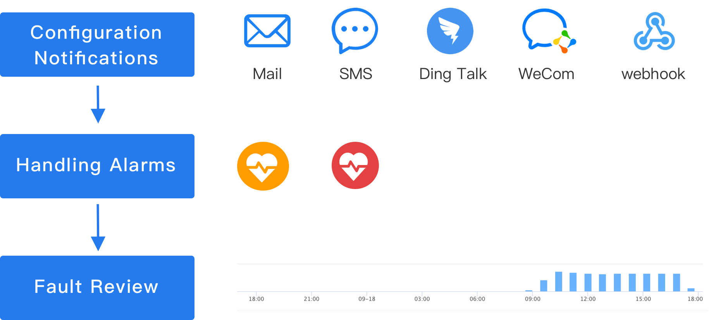

# 监控与告警

本地存储提供了开箱即用的监控指标采集和告警提醒能力。开启平台监控组件后，可从存储集群、存储性能和存储容量等方面进行监控和告警，且支持配置通知策略。

直观呈现的监控数据可用于为运维巡检或性能调优提供决策支持，完善的告警机制也将帮助保障存储系统的稳定运行。

## 监控

### 性能监控

平台默认会收集本地存储的读写带宽、IOPS、延迟等常用性能监控指标。在 **存储管理** > **本地存储** 页面的 **监控** 页签中，可查看指标的实时监控数据。

### 容量监控

由于本地存储仅能使用节点本地的存储资源，这要求存储使用人员在声明本地存储前，需确保节点上可用容量充足，避免因超额声明影响使用。

对此，平台在本地存储的 **详细信息** 中提供了对设备类的容量监控。若发现某类设备可用容量不足，需先清理空间或添加磁盘设备，然后再使用本地存储。

## 告警

平台默认启用了一批告警策略，一旦资源异常或监控数据达到预警状态，将自动触发告警。预置策略已能满足集群状态告警、设备类容量告警等常见运维需求。

### 配置通知

为了能及时收到告警，建议您在运维中心设置通知策略：将告警信息以邮件、短信等方式发送给相关人员，提醒其采取必要的措施解决问题或避免故障发生。单击   可切换至运维中心完成操作，参考 [创建告警策略]()。

### 处理告警

* 若监控到存储集群的健康状态为 `告警`，可参考下表在本地存储的 **详细信息** 页逐项排查并处理。

    |排查项| 对应状态 | 原因                                                     |
    | ---------- | -------- | ------------------------------------------------------------ |
    |**健康状态**| 告警     | 因节点服务异常或设备类异常导致。                   |
    |**服务状态**| 未知     | 即节点为 `notready` 的失联状态，可能由于网络故障或断电等原因导致。 |
    |**设备类状态**| 不可用   | 可能所用磁盘不是裸盘，或者磁盘不存在。                       |

* 若 **告警** 页签中触发了实时告警，即使存储集群当前为 `健康` 状态，也应及时处理告警，避免导致进一步故障。下表为预置策略所用告警等级的含义，可作为您制定告警处理原则的参考。
    
    |告警等级| 含义                                                  |
    | -------- | ------------------------------------------------------------ |
    |**灾难**| 告警规则对应的资源发生故障，导致平台业务中断、数据丢失，影响程度重大。 |
    |**严重**| 告警规则对应的资源存在已知问题，可能导致平台功能故障，影响业务正常运行。 |
    |**警告**| 告警规则对应的资源存在运行风险，如不及时处理，可能影响业务正常运行。 |

### 故障复盘

**告警历史** 中记录了所有曾经触发，当前已无须处理的告警。借助告警历史进行故障复盘时，为了能有效地达到经验总结目的，您可能需要回答以下问题。

* 事故发生时，具体的异常情况是什么？

* 告警列表中某条告警反复出现，是否有规律可循？能否在下次发生之前提前避免？
* 时间轴显示某个时段告警激增，是不可抗力导致还是运维事故？是否需要调整运维方案？

