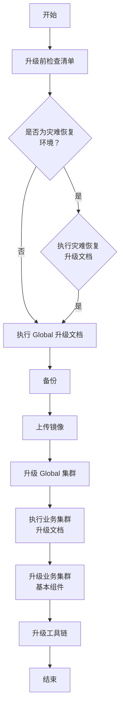

# 概述

本文件旨在为具备基本 Linux 知识的系统管理员详细说明<Term name="productShort" /> `global` 集群的完整升级过程。

在本文档中，将频繁使用以下术语，请注意区分：

- **`global` 集群**：指负责核心平台管理任务的集群，例如集群管理和租户管理。
- **平台**：通常指容器平台本身，是提供应用程序运行环境的完整系统，综合了容器调度、管理、网络、存储等功能。**平台** 是一个整体概念，涵盖了所有组件，包括 `global` 集群和工作负载集群。

# 升级过程

<table>
  <thead>
    <tr>
      <th>升级步骤</th>
      <th>升级内容</th>
      <th>时间窗口</th>
    </tr>
  </thead>

  <tbody>
    <tr>
      <td>升级前检查清单</td>
      <td>
        实施人员必须执行检查清单，并将结果报告给售后以进行风险评估。 
        如果项目没有执行检查清单，则禁止升级！ 
        是否为灾难恢复环境？ 
        如果是灾难恢复环境，请遵循灾难恢复功能，并最终验证备用集群之间的数据同步是否正常。
      </td>
      <td>在项目启动升级计划的前一周。</td>
    </tr>

    <tr>
      <td>检查数据同步</td>
      <td>检查集群之间的数据同步是否正常。</td>
      <td>在升级前一小时</td>
    </tr>

    <tr>
      <td>备份</td>
      <td>备份 etcd 和 Kubernetes 配置！具体步骤请参考“备份”部分。</td>
      <td>在升级前一小时进行备份。</td>
    </tr>

    <tr>
      <td>上传镜像</td>
      <td>根据客户的环境选择“使用在线升级上传镜像”或“使用离线安装包上传镜像”。具体步骤请参考“更新镜像”部分。</td>
      <td>在升级前一天</td>
    </tr>

    <tr>
      <td>升级 global 集群</td>
      <td>完成产品管理和 global 集群升级文档。具体步骤请参考“升级 Global 集群”部分。</td>
      <td>在升级当天执行</td>
    </tr>

    <tr>
      <td>执行业务集群升级文档</td>
      <td>在保证 global 升级成功后执行业务集群升级文档。具体步骤请参考“升级业务集群组件”部分。</td>
      <td>在升级当晚执行</td>
    </tr>

    <tr>
      <td>升级工具链</td>
      <td>具体步骤请参考“升级 DevOps 工具链实例”部分。</td>
      <td>在升级当晚执行</td>
    </tr>
  </tbody>
</table>

<Directive type="warning" title="警告">
  为了主动识别和解决升级过程中可能阻碍升级的问题，强烈建议在升级过程之前使用检查清单脚本进行集群检查。如果您不清楚检查清单脚本的可用位置，请联系售后支持人员。
</Directive>
