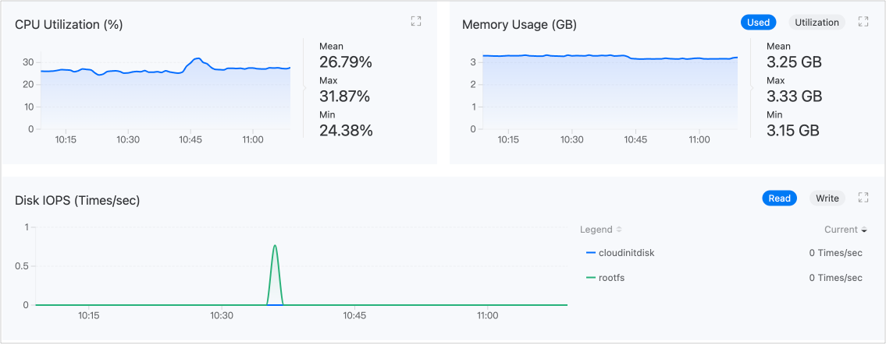

# 监控与告警

从 CPU、内存、存储及网络等方面对虚拟机进行监控和告警。为方便及时收到告警提醒，还支持配置通知策略。

直观呈现的监控数据可用于为运维巡检或性能调优提供决策支持，完善的告警和通知机制也将帮助保障虚拟机稳定运行。

## 监控

平台默认会收集虚拟机的 CPU、内存、存储及网络等常用性能监控指标。进入 **虚拟化** > **虚拟机** 页面，在虚拟机详情的 **监控** 页签中，可查看指标的实时监控数据。

## 告警

### 配置告警策略

为启用告警，请先创建告警策略。告警策略描述了您希望监控的对象、在什么情况下希望收到告警，以及如何被通知相关告警。进入 **Container Platform** > **虚拟化** > **虚拟机** 页面，在虚拟机详情的 **告警** 页签中，单击 **创建告警策略** 可完成配置。

|参数| 说明                                                         |
| -------- | ------------------------------------------------------------ |
|**告警类型**| - 指标告警：监控对象为平台预置指标，例如 *内存使用率* 。 - 事件告警：监控对象为事件原因，即虚拟机转换到当前状态的原因，例如：BackOff、Pulling、Failed。 |
|**触发条件**| 由比较运算符、告警阈值和持续时间组成。通过将实时监控结果与所设阈值进行比较，从而判断是否告警。 若设置了持续时间，平台还会比较监控对象进入告警状态的持续时间。 |
|**告警等级**| - 提示：监控对象存在预期中的问题，短期内不影响业务运行，但是存在潜在的风险。例如：CPU 使用率大于 70% 的状况持续了 3 分钟。 - 警告：监控对象存在运行风险，如不及时处理，可能影响业务正常运行。例如：CPU 使用率大于 80% 的状况持续了 3 分钟。 - 严重：监控对象存在已知问题，可能导致平台功能故障，影响业务正常运行。 - 灾难：监控对象故障，导致平台业务中断、数据丢失，影响程度重大。 |

**提示**：虚拟机告警功能与平台通用告警功能类似，更详细的配置指导可参考通用的 [告警]() 文档。

### 处理告警

进入 **告警** 页签，若提示有处于告警状态的策略时，请及时处理。

### 绑定通知策略

除了在 **告警** 页签中实时提醒外，平台还支持将告警信息以邮件、短信等方式发送给相关人员，通知其采取必要的措施解决问题或避免故障发生。通知策略需联系管理员设置后使用。