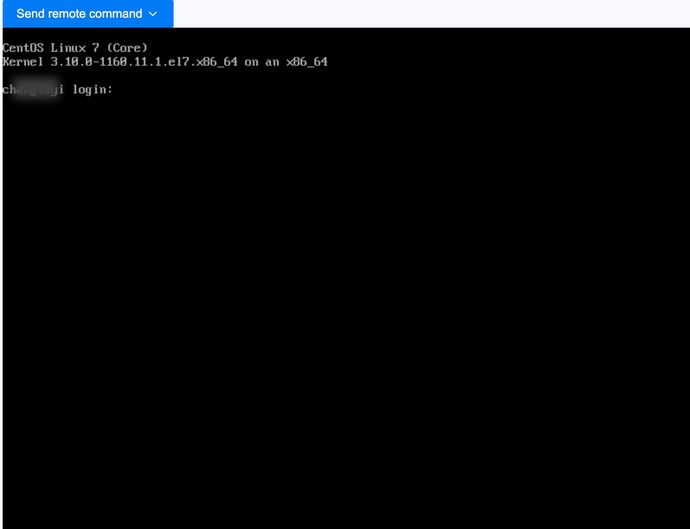

# 使用 VNC 登录虚拟机

使用 Web 控制台（VNC）登录虚拟机，作为应急操作手段。

## 操作步骤

1. 进入 **Container Platform**。

1. 在左侧导航栏中，单击 **虚拟化** > **虚拟机**。

2. 单击 ⋮ > **VNC 登录**。

4. 自动打开控制台窗口，需要输入用户名和密码登录。

    

    **说明**：
    
    * 支持发送常用键盘命令。

    * 支持复制和粘贴命令和参数。
