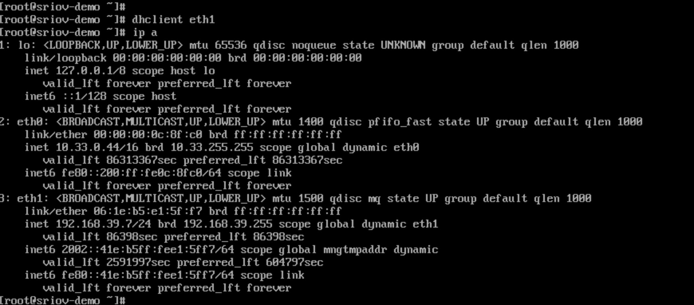

# 配置 SR-IOV

通过配置物理服务器节点，使其支持创建搭载 SR-IOV（单根 I/O 虚拟化，Single Root I/O Virtualization）网卡的虚拟机，实现了虚拟机更低延时，且支持 IPv6 单栈以及 IPv4/IPv6 双栈的功能。


## 名词解释

| 名词   |             解释                                    |
| :-------- | :------------------------------------------------------------ |
| Multus CNI | 可作为其他 CNI 插件与 Kubernetes 的中间件，使得 Kubernetes 支持 Pod 多网卡。 |
| SR-IOV | 可将节点的物理网卡虚拟化，拆分为多个 VF 供 Pod 或虚拟机使用，使其获得优越的网络性能。 |
| VF | 从物理 PCI 设备虚拟出来的设备，VF 可以直接分配给虚拟机或容器使用，类似一个独立的物理 PCI 设备，大大提高了 I/O 性能。 |


## 约束与限制

SR-IOV 功能依赖于 glibc，且仅支持 glibc 2.34 及以上版本，而麒麟 V10 及 CentOS 7.x 操作系统均不支持该版本，因此无法在这两种操作系统上使用 SR-IOV 功能。


## 前提条件

获取下述 Chart 及镜像并上传至镜像仓库中，本文档以 `build-harbor.example.cn` 仓库地址为例进行介绍，具体 Chart 及镜像的获取方式请联系相关人员。
 
### Chart

* `build-harbor.example.cn/example/chart-sriov-network-operator:v3.15.0`


### 镜像

* `build-harbor.example.cn/3rdparty/sriov/sriov-network-operator:4.13`
* `build-harbor.example.cn/3rdparty/sriov/sriov-network-operator-config-daemon:4.13`
* `build-harbor.example.cn/3rdparty/sriov/sriov-cni:4.13`
* `build-harbor.example.cn/3rdparty/sriov/ib-sriov-cni:4.13`
* `build-harbor.example.cn/3rdparty/sriov/sriov-network-device-plugin:4.13`
* `build-harbor.example.cn/3rdparty/sriov/network-resources-injector:4.13`
* `build-harbor.example.cn/3rdparty/sriov/sriov-network-operator-webhook:4.13`
* `build-harbor.example.cn/3rdparty/kubectl:v3.15.1`


## 操作步骤

**注意**：下述所有命令均在终端中执行。

<Steps>

### 在物理机的 BIOS 中启用 SR-IOV

配置前可使用下述命令查看主板信息。

```bash
$ dmidecode -t 1
# dmidecode 3.3
Getting SMBIOS data from sysfs.
SMBIOS 2.7 present.
 
Handle 0x0100, DMI type 1, 27 bytes
System Information
    Product Name: PowerEdge R620
    Version: Not Specified
    Serial Number: 7SJNF62
    UUID: 4c4c4544-0053-4a10-804e-b7c04f463632
    Wake-up Type: Power Switch
    SKU Number: SKU=NotProvided;ModelName=PowerEdge R620
    Family: Not Specified
```

在不同厂商服务器的 BIOS 中启用 SR-IOV 的操作会有所区别，具体请参考对应厂商的文档，一般操作如下。

1. 重新启动服务器。

2. 当屏幕显示品牌 LOGO 时，在 BIOS 开机自检过程中，按 F2 键进入系统设置程序。

3. 单击 **Processor Settings** > **Virtualization Technology**，将 **Virtualization Technology** 设置更改为 `Enabled`。 

4. 单击 **Settings** > **Integrated devices**，将 **SR-IOV Global Enable** 设置更改为 `Enabled`。

5. 保存配置并重新启动服务器。

### 开启 IOMMU
在不同操作系统开启 IOMMU 的操作会有所区别，具体请参考对应操作系统文档，本文以 CentOS 为例进行介绍。


1. 编辑 `/etc/default/grub` 文件，在 `GRUB_CMDLINE_LINUX` 配置项中增加 `intel_iommu=on iommu=pt`。

    ```bash
    GRUB_CMDLINE_LINUX="crashkernel=auto rd.lvm.lv=centos/root rhgb quiet intel_iommu=on iommu=pt"
    ```

2. 执行下述命令生成 `grub.cfg` 文件。

    ```bash
    grub2-mkconfig -o /boot/grub2/grub.cfg
    ```

3. 重新启动服务器.


4. 执行下述命令，若回显信息中显示 `IOMMU enabled`，则表示开启成功。

    ```bash
    dmesg | grep -i iommu
    ```

### 系统内核加载 VFIO 模块

1. 执行下述命令加载 vfio-pci 模块。
    
    ```bash
    $ modprobe vfio-pci
    ```
	
2. 加载完成后，执行下述命令，若能正常显示配置信息则表示 VFIO 内核模块已正常加载。
    
    ```bash
    $ # centos 执行下述命令检查 VFIO 加载情况
    $ lsmod|grep vfio
    vfio_pci               41993  0
    vfio_iommu_type1       22440  0
    vfio                   32657  2 vfio_iommu_type1,vfio_pci
    irqbypass              13503  2 kvm,vfio_pc
    $
    $
    $ # ubuntu 执行下述命令检查 VFIO 加载情况
    $ cat /lib/modules/$(uname -r)/modules.builtin | grep vfio
    kernel/drivers/vfio/vfio.ko
    kernel/drivers/vfio/vfio_virqfd.ko
    kernel/drivers/vfio/vfio_iommu_type1.ko
    kernel/drivers/vfio/pci/vfio-pci-core.ko
    kernel/drivers/vfio/pci/vfio-pci.ko
    ```
	
### 创建 VF 设备

1. 执行下述命令查看当前支持 VF 的设备。
    
    ```bash
    $ find /sys -name *vfs*
    
    /sys/devices/pci0000:00/0000:00:03.0/0000:05:00.1/sriov_totalvfs
    /sys/devices/pci0000:00/0000:00:03.0/0000:05:00.1/sriov_numvfs
    /sys/devices/pci0000:00/0000:00:03.0/0000:05:00.0/sriov_totalvfs
    /sys/devices/pci0000:00/0000:00:03.0/0000:05:00.0/sriov_numvfs
    ```
	
	回显信息说明如下:
	* **0000:05:00.1**：SR-IOV 物理网卡 enp5s0f1 的 PCI 地址。
	
	* **0000:05:00.0**：SR-IOV 物理网卡 enp5s0f0 的 PCI 地址。
	
	* **sriov_totalvfs**：支持的 VF 数量。
	
	* **sriov_numvfs**：当前的 VF 数量。
	
	
2. 执行下述命令获取物理机网卡信息。

    ```bash
    $ ifconfig
    
    enp5s0f0: flags=4163<UP,BROADCAST,RUNNING,MULTICAST>  mtu 1500
            inet 192.168.66.213  netmask 255.255.255.0  broadcast 192.168.66.255
            inet6 1066::192:168:66:213  prefixlen 112  scopeid 0x0<global>
            inet6 fe80::a236:9fff:fe29:6c00  prefixlen 64  scopeid 0x20<link>
            ether a0:36:9f:29:6c:00  txqueuelen 1000  (Ethernet)
            RX packets 13889  bytes 1075801 (1.0 MB)
            RX errors 0  dropped 1603  overruns 0  frame 0
            TX packets 5057  bytes 440807 (440.8 KB)
            TX errors 0  dropped 0 overruns 0  carrier 0  collisions 0
     
    enp5s0f1: flags=4163<UP,BROADCAST,RUNNING,MULTICAST>  mtu 1500
            inet6 fe80::a236:9fff:fe29:6c02  prefixlen 64  scopeid 0x20<link>
            ether a0:36:9f:29:6c:02  txqueuelen 1000  (Ethernet)
            RX packets 1714  bytes 227506 (227.5 KB)
            RX errors 0  dropped 1604  overruns 0  frame 0
            TX packets 70  bytes 19241 (19.2 KB)
            TX errors 0  dropped 0 overruns 0  carrier 0  collisions 0
     ```
3. 	执行 `ethtool -i  <物理网卡名称>` 命令获取对应物理网卡的 PCI 地址，具体示例如下。
	
    ```bash
    $ ethtool -i  enp5s0f0
    driver: ixgbe
    version: 5.15.0-76-generic
    firmware-version: 0x8000030d, 14.5.8
    expansion-rom-version:
    bus-info: 0000:05:00.0     ## enp5s0f0 网卡的 PCI 地址
    supports-statistics: yes
    supports-test: yes
    supports-eeprom-access: yes
    supports-register-dump: yes
    supports-priv-flags: yes
    $
    $
    $ ethtool -i  enp5s0f1
    driver: ixgbe
    version: 5.15.0-76-generic
    firmware-version: 0x8000030d, 14.5.8
    expansion-rom-version:
    bus-info: 0000:05:00.1    ## enp5s0f1 网卡的 PCI 地址
    supports-statistics: yes
    supports-test: yes
    supports-eeprom-access: yes
    supports-register-dump: yes
    supports-priv-flags: yes
    ```
4. 执行下述命令创建 VF，本文以配置 enp5s0f1 网卡为例进行介绍，若有多块网卡需要虚拟化，则所有网卡都需要配置。

    ```bash
    $ cat /sys/devices/pci0000:00/0000:00:03.0/0000:05:00.1/sriov_totalvfs   ##查看支持的 VF 数量
    63
    $
    $ echo 8 > /sys/devices/pci0000:00/0000:00:03.0/0000:05:00.1/sriov_numvfs  ##设置当前的 VF 数量
    $
    $ cat /sys/devices/pci0000:00/0000:00:03.0/0000:05:00.1/sriov_numvfs   ##查看当前的 VF 数量
    8
    ```
5. 执行下述命令检查 VF 是否创建成功。

   **说明**：可以看到配置的 8 个 VF 的地址，例如：`05:10.1`。这些 VF 地址需要补充 **域标识符** ，最终结果为：`0000:05:10.1`。
    
    ```bash
    $ lspci |grep Virtual
    00:11.0 PCI bridge: Intel Corporation C600/X79 series chipset PCI Express Virtual Root Port (rev 05)
    05:10.1 Ethernet controller: Intel Corporation 82599 Ethernet Controller Virtual Function (rev 01)
    05:10.3 Ethernet controller: Intel Corporation 82599 Ethernet Controller Virtual Function (rev 01)
    05:10.5 Ethernet controller: Intel Corporation 82599 Ethernet Controller Virtual Function (rev 01)
    05:10.7 Ethernet controller: Intel Corporation 82599 Ethernet Controller Virtual Function (rev 01)
    05:11.1 Ethernet controller: Intel Corporation 82599 Ethernet Controller Virtual Function (rev 01)
    05:11.3 Ethernet controller: Intel Corporation 82599 Ethernet Controller Virtual Function (rev 01)
    05:11.5 Ethernet controller: Intel Corporation 82599 Ethernet Controller Virtual Function (rev 01)
    05:11.7 Ethernet controller: Intel Corporation 82599 Ethernet Controller Virtual Function (rev 01)
    ```


### 绑定 VFIO 驱动

1. 下载 <a href="/scripts/dpdk-devbind.py" download="dpdk-devbind.py">绑定脚本</a> 文件，并执行 `$ python3 dpdk-devbind.py -b vfio-pci <带域标识符的 VF 地址>` 命令将 enp5s0f1 网卡的 8 个 VF 绑定至 vfio-pci 驱动程序，具体示例如下。

    ```bash
    $ python3 dpdk-devbind.py -b vfio-pci 0000:05:10.1
    $ python3 dpdk-devbind.py -b vfio-pci 0000:05:10.3
    $ python3 dpdk-devbind.py -b vfio-pci 0000:05:10.5
    $ python3 dpdk-devbind.py -b vfio-pci 0000:05:10.7
    $ python3 dpdk-devbind.py -b vfio-pci 0000:05:11.1
    $ python3 dpdk-devbind.py -b vfio-pci 0000:05:11.3
    $ python3 dpdk-devbind.py -b vfio-pci 0000:05:11.5
    $ python3 dpdk-devbind.py -b vfio-pci 0000:05:11.7
    ```
2. 绑定成功后执行下述命令查看绑定结果，在回显结果的 **Network devices using DPDK-compatible driver** 区域下查看已经绑定的 VF 的驱动。其中，VF 设备 ID 为 `10ed`。<a id="VF_ID"></a>

    ```bash
    $ python3 dpdk-devbind.py --status
     
    Network devices using DPDK-compatible driver
    ============================================
    0000:05:10.1 '82599 Ethernet Controller Virtual Function 10ed' drv=vfio-pci unused=ixgbevf
    0000:05:10.3 '82599 Ethernet Controller Virtual Function 10ed' drv=vfio-pci unused=ixgbevf
    0000:05:10.5 '82599 Ethernet Controller Virtual Function 10ed' drv=vfio-pci unused=ixgbevf
    0000:05:10.7 '82599 Ethernet Controller Virtual Function 10ed' drv=vfio-pci unused=ixgbevf
    0000:05:11.1 '82599 Ethernet Controller Virtual Function 10ed' drv=vfio-pci unused=ixgbevf
    0000:05:11.3 '82599 Ethernet Controller Virtual Function 10ed' drv=vfio-pci unused=ixgbevf
    0000:05:11.5 '82599 Ethernet Controller Virtual Function 10ed' drv=vfio-pci unused=ixgbevf
    0000:05:11.7 '82599 Ethernet Controller Virtual Function 10ed' drv=vfio-pci unused=ixgbevf
     
    Network devices using kernel driver
    ===================================
    0000:01:00.0 'NetXtreme BCM5720 Gigabit Ethernet PCIe 165f' if=eno1 drv=tg3 unused=vfio-pci
    0000:01:00.1 'NetXtreme BCM5720 Gigabit Ethernet PCIe 165f' if=eno2 drv=tg3 unused=vfio-pci
    0000:02:00.0 'NetXtreme BCM5720 Gigabit Ethernet PCIe 165f' if=eno3 drv=tg3 unused=vfio-pci
    0000:02:00.1 'NetXtreme BCM5720 Gigabit Ethernet PCIe 165f' if=eno4 drv=tg3 unused=vfio-pci
    0000:05:00.0 'Ethernet 10G 2P X520 Adapter 154d' if=enp5s0f0 drv=ixgbe unused=vfio-pci *Active*
    0000:05:00.1 'Ethernet 10G 2P X520 Adapter 154d' if=enp5s0f1 drv=ixgbe unused=vfio-pci
     
    No 'Baseband' devices detected
    ==============================
     
    No 'Crypto' devices detected
    ============================
     
    No 'DMA' devices detected
    =========================
     
    No 'Eventdev' devices detected
    ==============================
     
    No 'Mempool' devices detected
    =============================
     
    No 'Compress' devices detected
    ==============================
     
    No 'Misc (rawdev)' devices detected
    ===================================
     
    No 'Regex' devices detected
    ===========================
    ```


### 部署 Multus CNI 插件\{#deploy_plugins}


1. 进入 **平台管理**。

2. 在左侧导航栏中，单击 **集群管理** > **集群**。

3. 单击虚拟机集群名称，切换至 **插件** 页签。

    * 部署 **Multus CNI** 插件。

### 部署 sriov-network-operator

执行下述命令部署 sriov-network-operator。

```bash
REGISTRY=<$registry>  # 将 <$registry> 部分替换成 sriov-network-operator 镜像所在的仓库地址，例如：REGISTRY=build-harbor.example.cn
NICSELECTOR=["<nics>"] # 将 <nics> 部分替换成网卡名称，例如：NICSELECTOR=["ens802f1","ens802f2"]，多个使用逗号分隔
NUMVFS=<numVfs> # 将 <numVfs> 部分替换成 VF 数量，例如：NUMVFS=8
  
cat <<EOF | kubectl create -f -
apiVersion: operator.alauda.io/v1alpha1
kind: AppRelease
metadata:
  annotations:
    auto-recycle: "true"
    interval-sync: "true"
  name: sriov-network-operator
  namespace: cpaas-system
spec:
  destination:
    cluster: ""
    namespace: "kube-system"
  source:
    charts:
    - name: <chartName> # 需使用实际的 chart 路径替换 <chartName> 部分，例如：name = example/chart-sriov-network-operator
      releaseName: sriov-network-operator
      targetRevision: v3.15.0
    repoURL: $REGISTRY
  timeout: 120
  values:
    global:
      registry:
        address: $REGISTRY
    networkNodePolicy:
      nicSelector: $NICSELECTOR
      numVfs: $NUMVFS
EOF
```

### 为物理节点设置节点角色标识的标签

**注意**：执行此操作前，请确保 `sriov-network-operator` 的 Pod 资已正常运行。

1. 进入 **平台管理**。

2. 在左侧导航栏中，单击 **集群管理** > **集群**。

3. 单击集群名称，切换至 **节点** 页签。

4. 单击支持 SR-IOV 的物理节点 ⋮ > **更新节点标签**。

5. 为节点设置标签，标签信息如下：

    * `node-role.kubernetes.io/worker: ""`

    
6. 单击 **更新**。

### 检查资源是否创建成功\{#checkpod}

在 CLI 中工具中执行 `kubectl -n cpaas-system get sriovnetworknodestates` 命令检查 `sriovnetworknodestates` 资源是否创建成功，若出现类似如下回显信息，则表示创建成功。若资源创建失败，请检查 Multus CNI 插件及 sriov-network-operator 是否部署成功。

```bash
$  kubectl -n cpaas-system get sriovnetworknodestates
NAME                      SYNC STATUS           AGE
192.168.254.88            Succeeded             5d22h
```

### 为物理节点设置 SR-IOV 节点特性的标签

**注意**：执行此操作前，请确保 `sriovnetworknodestates` 资源已成功创建。

1. 进入 **平台管理**。

2. 在左侧导航栏中，单击 **集群管理** > **集群**。

3. 单击集群名称，切换至 **节点** 页签。

4. 单击支持 SR-IOV 的物理节点 ⋮ > **更新节点标签**。

5. 为节点设置标签，标签信息如下：

    * `feature.node.kubernetes.io/network-sriov.capable: "true"`


    
### 检查是否支持网卡设备


1. 执行 `lspci -n -s <带域标识符的 VF 地址>` 命令获取当前网卡设备的厂商 ID、设备 ID，具体示例如下。


    ```bash
    $ lspci -n -s 0000:05:00.1
    05:00.1 0200: 8086:154d (rev 01)
    ```

	回显信息说明如下：
		
	* **8086**：厂商 ID。
    
	* **154d**：设备 ID。

2. 执行 `lspci -s <带域标识符的 VF 地址> -vvv | grep Ethernet` 命令获取当前网卡名称，具体示例如下。

    ```bash
    $ lspci -s 0000:05:00.1 -vvv | grep Ethernet
    05:00.1 Ethernet controller: Intel Corporation Ethernet 10G 2P X520 Adapter (rev 01)
    ```

3.  在 cpaas-system 命名空间下，找到名称为 supported-nic-ids、类型为 ConfigMap 的配置文件，检查其 data 区域的支持列表中，是否有当前网卡的配置信息。

    **注意**：若支持列表中没有当前网卡，则需参考[步骤4](#configmap1)将网卡添加至配置文件中，若支持列表中有当前网卡，则跳过[步骤4](#configmap1)。

    ```bash
    kind: ConfigMap
    apiVersion: v1
    metadata:
      name: supported-nic-ids
      namespace: cpaas-system
    data:
      Broadcom_bnxt_BCM57414_2x25G: 14e4 16d7 16dc
      Broadcom_bnxt_BCM75508_2x100G: 14e4 1750 1806
      Intel_i40e_10G_X710_SFP: 8086 1572 154c
      Intel_i40e_25G_SFP28: 8086 158b 154c
      Intel_i40e_40G_XL710_QSFP: 8086 1583 154c
      Intel_i40e_X710_X557_AT_10G: 8086 1589 154c
      Intel_i40e_XXV710: 8086 158a 154c
      Intel_i40e_XXV710_N3000: 8086 0d58 154c
      Intel_ice_Columbiaville_E810: 8086 1591 1889
      Intel_ice_Columbiaville_E810-CQDA2_2CQDA2: 8086 1592 1889
      Intel_ice_Columbiaville_E810-XXVDA2: 8086 159b 1889
      Intel_ice_Columbiaville_E810-XXVDA4: 8086 1593 1889
    ```

4. 将当前网卡以 `<网卡名称>: <厂商 ID> <设备 ID> <VF 设备 ID>` 的形式，添加到 data 区域的支持列表中，具体示例如下。<a id="configmap1"></a>

    ```bash
    kind: ConfigMap
    apiVersion: v1
    metadata:
      name: supported-nic-ids
      namespace: cpaas-system
    data:
      Broadcom_bnxt_BCM57414_2x25G: 14e4 16d7 16dc
      Broadcom_bnxt_BCM75508_2x100G: 14e4 1750 1806
      
      Intel_Corporation_X520: 8086 154d 10ed            ## 新增网卡信息
      
      Intel_i40e_10G_X710_SFP: 8086 1572 154c
      Intel_i40e_25G_SFP28: 8086 158b 154c
      Intel_i40e_40G_XL710_QSFP: 8086 1583 154c
      Intel_i40e_X710_X557_AT_10G: 8086 1589 154c
      Intel_i40e_XXV710: 8086 158a 154c
      Intel_i40e_XXV710_N3000: 8086 0d58 154c
      Intel_ice_Columbiaville_E810: 8086 1591 1889
      Intel_ice_Columbiaville_E810-CQDA2_2CQDA2: 8086 1592 1889
      Intel_ice_Columbiaville_E810-XXVDA2: 8086 159b 1889
      Intel_ice_Columbiaville_E810-XXVDA4: 8086 1593 1889
    ```
   
   参数配置说明：
    * **Intel\_Corporation\_X520**：网卡的名称，该名称可自定义输入。
    
    * **8086**：厂商 ID。
    
    * **154d**：设备 ID。
    
    * **10ed**：VF 设备 ID，可在[绑定结果](#VF_ID)中查看。
    


    
### 配置 IP 地址

登录到交换机上配置 DHCP（动态主机配置协议，Dynamic Host Configuration Protocol）。

**注意**：若不支持使用 DHCP，请到虚拟机中手动配置 IP 地址。

</Steps>


## 结果验证


1. 进入 **Container Platform**。

2. 在左侧导航栏中，单击 **虚拟化** > **虚拟机**。

3. 单击 **创建虚拟机**，在添加辅助网卡时，**网络类型** 选择 **SR-IOV**。

4. 完成虚拟机创建。

5. 通过 VNC 进入到虚拟机，可以看到 eth1 已成功获取 IP 地址，至此方案配置成功。
    

## 相关说明

### CentOS 虚拟机内核参数配置

CentOS 虚拟机使用 SR-IOV 网卡后，需要修改对应网卡的内核参数，具体步骤如下。

1. 打开终端，执行下述命令修改对应网卡的内核参数，需将命令中 `<网卡名称>` 部分，替换为实际的网卡名称。

    ```bash
    sysctl -w net.ipv4.conf.<网卡名称>.rp_filter=2
    echo "net.ipv4.conf.<网卡名称>.rp_filter=2" >> /etc/sysctl.conf
    ```

2. 执行下述命令，加载和应用 /etc/sysctl.conf 文件中所有内核参数的命令，使内核配置生效。当看到回显信息中的值为 2，则表示修改成功。

    ```bash
    sysctl -p
    ```
    
    回显信息：
    
    ```bash
    net.ipv4.conf.<网卡名称>.rp_filter = 2
    ```

