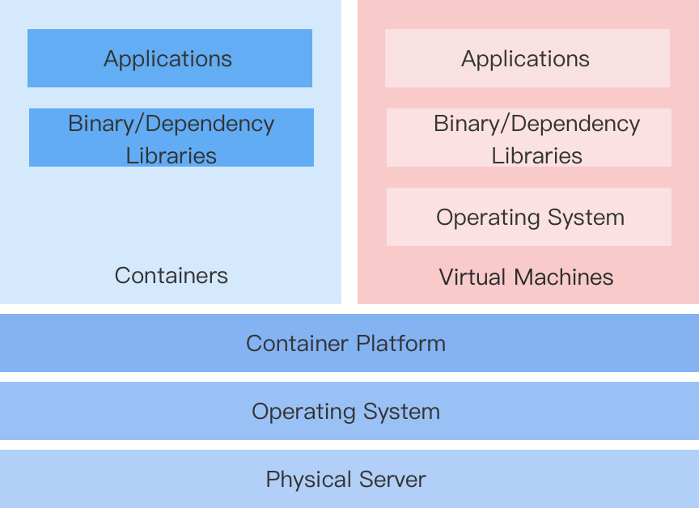

# 介绍

对于使用基于虚拟机架构的企业而言，向基于 Kubernetes 和容器架构的转型不可避免地需要进行应用现代化。然而，由于需要持续的业务在线或者改变开发习惯的困难等因素，企业往往无法在短时间内完全脱离虚拟化架构。

因此，一个能够在同一平台上统一配置、管理和控制容器资源与虚拟机资源的解决方案变得尤为重要。

## 容器编排虚拟机解决方案

该平台基于开源组件 KubeVirt 实现了一种虚拟机（VMI，VirtualMachineInstance）解决方案，使得创建容器编排的虚拟机和运行虚拟化应用程序变得更加简便和快速。

## 功能特点

**快速转型**

无需重写应用程序或修改镜像。只需将现有应用打包为 qcow2 或 raw 格式的虚拟机镜像，然后在平台上使用该镜像创建虚拟机，从而将应用部署到容器平台。

**保持行为习惯**

容器化的虚拟机可以采用与传统虚拟机类似的管理方法，无需关注底层的容器实现，包括虚拟机生命周期管理、磁盘和网络管理以及快照管理。

**虚拟化与容器化的共存**

- 统一平台支持管理虚拟化服务，同时能够实现基于 Kubernetes 的容器调度与管理。

- 在继续使用虚拟机工作负载的基础上，允许逐步实现容器化应用的现代化。

- 新开发的需要与虚拟化应用交互的容器化应用不受影响。

## 产品功能

- **虚拟机**：支持使用管理员分配的镜像创建虚拟机并进行管理，包括启动和停止虚拟机、管理快照、远程登录虚拟机，以及修改虚拟机配置。

- **虚拟磁盘**：支持查看和管理当前项目中创建的磁盘信息，包括创建磁盘、查看磁盘名称、存储类、容量以及关联的虚拟机。

- **虚拟机快照**：支持查看虚拟机快照的状态、关联的虚拟机以及最近的回滚时间等详细信息。

- **虚拟机镜像**：支持查看当前项目下的虚拟机镜像信息，包括镜像提供方式和操作系统等。

- **密钥对**：支持查看和管理当前项目中创建的密钥对，包括创建密钥对和查看关联的虚拟机列表。

## 约束和限制

必须在物理机集群的基础上实现，并且 KubeVirt 组件必须在集群中部署并启用虚拟化。平台提供通过 Operator 部署 KubeVirt 组件的能力，并具备启用虚拟化的接口，所有相关配置由平台管理员完成。
