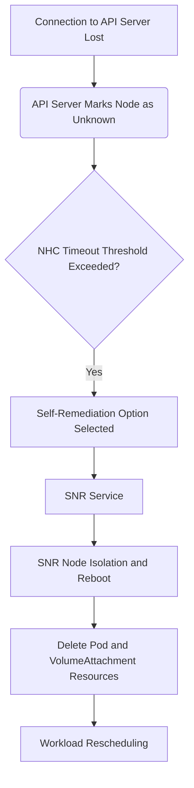

# 配置虚拟机高可用

## 功能概述 

硬件并不完美，软件难免存在缺陷。当发生节点级故障（例如内核挂死或网络接口控制器失效）时，集群所需处理的工作不会减少，受影响节点上的工作负载必须转移到其他位置重启。但部分特殊负载（如虚拟机、ReadWriteOnce卷和StatefulSet）可能需要遵循"至多一个"的语义规则。

这类工作负载一旦发生故障，可能导致数据丢失或损坏。关键是要确保节点进入安全状态（即"隔离"机制），之后才能启动工作负载的恢复流程（即"修复"），理想情况下还应包含节点恢复流程。

依赖管理员人工确认节点与工作负载的真实状态往往不切实际。为此，平台提供了多个组件，实现故障检测、隔离与修复的自动化流程。

## 名词说明

| **名称** | **说明** |
| :--- | :--- |
| **SNR** | Self Node Remediation | 
| **NHC** | Node Health Check |

## 组件介绍

- **Self Node Remediation Operator**

    Self Node Remediation Operator 是平台的附加组件，通过外部系统实现隔离与修复机制：自动重启不健康节点并删除 Pod 及 VolumeAttachment 等资源。重启操作确保工作负载进入隔离状态，资源删除则加速受影响负载的重新调度。与其他外部系统不同，Self Node Remediation 无需依赖管理接口（如 IPMI 或节点供应 API）。

    故障检测系统（如 NodeHealthCheck）可调用该自愈机制。

- **Node Health Check Operator**

    Node Health Check Operator 是平台的附加组件，用于监控节点状态的故障检测系统。该组件本身不具备内置的隔离或自愈机制，因此必须配置提供这些功能的外部系统；默认情况下，其采用 Self Node Remediation 实现故障恢复。

## 隔离与自愈事件流程



## 操作步骤

<Steps>

### 上架软件包

1. **下载** 与平台架构相对应的 **Alauda Build of SelfNodeRemediation** 安装包。
2. **上传** **Alauda Build of SelfNodeRemediation** 安装包，使用上架包机制。
3. **下载** 与平台架构相对应的 **Alauda Build of NodeHealthCheck**安装包。
4. **上传** **Alauda Build of NodeHealthCheck** 安装包，使用上架包机制。

### 部署 Self Node Remediation Operator

1. 登录，进入 **平台管理** 页面。

2. 点击 **应用商店管理** > **OperatorHub** 进入 **OperatorHub** 页面。

3. 找到 **Alauda Build of SelfNodeRemediation**，点击 **安装**，进入 **安装 Alauda Build of SelfNodeRemediation** 页面。

   配置参数：

   | **参数**               | **推荐配置**                                                                                                         |
   | :--------------------- | :------------------------------------------------------------------------------------------------------------------ |
   | **频道**               | 默认频道为 `alpha`。                                                                                                 |
   | **安装模式**           | `集群`：所有命名空间共享一个 Operator 实例进行创建和管理，资源使用更低。                                           |
   | **安装位置**           | 选择 `推荐`，命名空间仅支持 **workload-availability**。                                                                           |
   | **升级策略**           | `手动`：当 Operator Hub 有新版本时，需要手动确认才能将 Operator 升级到最新版本。                                   |

### 更新 Self Node Remediation Operator（可选）

Self Node Remediation Operator 部署后会自动在 Operator 部署的命名空间中创建名称为 `self-node-remediation-config` 的 `SelfNodeRemediationConfig` CR。

<Directive type="info" title="提示">
修改 `SelfNodeRemediationConfig` CR 将重新创建 Self Node Remediation 守护进程集。
</Directive>

`SelfNodeRemediationConfig` CR类似于以下YAML文件：

```yaml
apiVersion: self-node-remediation.medik8s.io/v1alpha1
kind: SelfNodeRemediationConfig
metadata:
  name: self-node-remediation-config
  namespace: workload-availability
spec:
  safeTimeToAssumeNodeRebootedSeconds: 180 
  watchdogFilePath: /dev/watchdog 
  isSoftwareRebootEnabled: true 
  apiServerTimeout: 15s 
  apiCheckInterval: 5s 
  maxApiErrorThreshold: 3 
  peerApiServerTimeout: 5s 
  peerDialTimeout: 5s 
  peerRequestTimeout: 5s 
  peerUpdateInterval: 15m 
  hostPort: 30001 
  customDsTolerations: 
  - effect: NoSchedule
    key: node-role.kubernetes.io.infra
    operator: Equal
    value: "value1"
    tolerationSeconds: 3600
```
参数说明：

| **参数** | **说明** |
| :--- | :--- |
| **safeTimeToAssumeNodeRebootedSeconds** | 为确保数据一致性，需为操作器配置可选等待时长，该时长代表在恢复故障节点工作负载前的强制延迟窗口。若过早启动替换Pod（当故障节点仍可能运行时），将引发双重风险：数据损坏与单实例运行规则的破坏。操作器通过动态计算得出最小安全时长，关键参数包括：`ApiServerTimeout`，`ApiCheckInterval`, `MaxApiErrorThreshold`, `PeerDialTimeout`, `PeerRequestTimeout`, `watchdog timeout` 以及|
| **watchdogFilePath** | 配置节点看门狗设备的文件路径。若路径配置错误，自主节点自愈操作器将自动切换至软看门狗设备路径（如/dev/watchdog）。当硬件看门狗不可用时，SelfNodeRemediationConfig 自定义资源(CR)将自动降级为软件级冷重启。 |
| **isSoftwareRebootEnabled** | 指定是否启用异常节点的软件级冷重启功能。默认配置中，isSoftwareRebootEnabled参数值为true。如需禁用此功能，请将该参数显式设置为false。 |
| **apiServerTimeout** | 配置用于检测API服务器连通性的超时窗口（单位为毫秒）。当检测超时后，操作器将立即触发节点自愈流程。​关键技术约束​：该超时必须 ≥ 10 毫秒（≈ 单个网络数据包往返时间下限）。 |
| **apiCheckInterval** | 配置API服务器连通性的检测频率（单位为秒）。​关键技术约束​：检测间隔必须 ≥ 1秒（≡ 1000毫秒），这是避免误触发自愈流程的最小时间精度。 |
| **maxApiErrorThreshold** | 配置节点启动对等节点通信的故障累积阈值（单位为秒）。​核心机制​：当本地检测失败达到该阈值后，节点将主动发起验证请求（这是触发节点隔离前的关键协同步骤）。​技术约束​：该阈值必须 ≥ 1秒。 | 
| **peerApiServerTimeout** | 配置对等节点连接API服务器的超时窗口（单位为毫秒）。​核心机制​：此阈值决定节点间协同验证API连通性的最大容忍等待时间。​强制约束​：超时值必须 ≥ 10毫秒（≈ 单个TCP握手最小耗时）。 |
| **peerDialTimeout** | 配置节点与对等节点建立连接的超时窗口（单位为毫秒）。​核心机制​：此阈值控制建立节点间通信通道的最大容忍时长。​强制约束​：超时值必须 ≥ 10毫秒（这是保障分布式系统最小协同粒度的物理极限）。 |
| **peerRequestTimeout** | 配置节点等待对等节点响应的超时窗口（单位为毫秒）。​核心机制​：此阈值决定发起请求后等待响应的最长时间。​强制约束​：超时值必须 ≥ 10毫秒（≈ 两次CPU上下文切换的最小耗时）。 |
| **peerUpdateInterval** | 配置对等节点信息（如IP地址）的更新频率，单位为秒。​关键约束​：更新间隔必须 ≥ 10秒（这是保障分布式集群拓扑最终一致性的最小同步周期）。|
| **hostPort** | 配置自主节点自愈守护进程内部通信端口的可选值。该值必须 >0，默认端口为 30001。 | 
| **customDsTolerations** | 为守护进程集上运行的自主节点自愈守护进程指定自定义容忍度机制，以适配各类节点的自愈需求。 |

<Directive type="info" title="提示">
- Operator 默认在部署命名空间创建自定义资源(CR)。
- CR 必须命名为 `self-node-remediation-config`。
- 仅允许存在一个 `SelfNodeRemediationConfig` CR。
- 删除该CR将立即禁用 Self Node Remediation 功能。
</Directive>

### 更新 Self Node Remediation Template（可选）

自主节点自愈操作器同时创建 SelfNodeRemediationTemplate 自定义资源定义（CRD）。该 CRD 定义了旨在加速工作负载恢复的节点自愈策略，包含以下三种方案：

- **Automatic**

    由操作器自主选择最优自愈策略：优先检测集群是否支持 `OutOfServiceTaint`，若支持则启用该策略，否则使用 `ResourceDeletion`。

- **ResourceDeletion**

    直接移除故障节点上的 Pod。

- **OutOfServiceTaint**

    此修复策略隐式地导致删除节点上的 Pod 和相关 VolumeAttachment，而不是删除节点对象。它通过在节点上放置 `OutOfServiceTaint` 策略来实现这一点。

操作器为自动策略创建名为 `self-node-remediation-automatic-strategy-template` 的自愈模板（SelfNodeRemediationTemplate CR），其 YAML 结构如下所示：

```yaml
apiVersion: self-node-remediation.medik8s.io/v1alpha1
kind: SelfNodeRemediationTemplate
metadata:
  creationTimestamp: "2022-03-02T08:02:40Z"
  name: self-node-remediation-<remediation_object>-deletion-template 
  namespace: workload-availability
spec:
  template:
    spec:
      remediationStrategy: <remediation_strategy>  
```

参数说明：

| **参数** | **说明** |
| :--- | :--- |
| **remediation_strategy** | 取值：Automatic、ResourceDeletion、OutOfServiceTaint |

### 部署 Node Health Check Operator

1. 登录，进入 **平台管理** 页面。

2. 点击 **应用商店管理** > **OperatorHub** 进入 **OperatorHub** 页面。

3. 找到 **Alauda Build of NodeHealthCheck**，点击 **安装**，进入 **安装 Alauda Build of NodeHealthCheck** 页面。

   配置参数：

   | **参数**               | **推荐配置**                                                                                                         |
   | :--------------------- | :------------------------------------------------------------------------------------------------------------------ |
   | **频道**               | 默认频道为 `alpha`。                                                                                                 |
   | **安装模式**           | `集群`：所有命名空间共享一个 Operator 实例进行创建和管理，资源使用更低。                                           |
   | **安装位置**           | 选择 `推荐`，命名空间仅支持 **workload-availability**。                                                                           |
   | **升级策略**           | `手动`：当 Operator Hub 有新版本时，需要手动确认才能将 Operator 升级到最新版本。                                   |

### 创建 NodeHealthCheck 实例

在集群 control 节点上执行以下命令：

<Tabs>
<Tab label="命令">
```yaml
cat << EOF | kubectl apply -f -
apiVersion: remediation.medik8s.io/v1alpha1
kind: NodeHealthCheck
metadata:
  name: nodehealthcheck-<name>
spec:
  minHealthy: <minHealthy>
  remediationTemplate:
    apiVersion: self-node-remediation.medik8s.io/v1alpha1
    kind: SelfNodeRemediationTemplate
    name: self-node-remediation-automatic-strategy-template
    namespace: workload-availability
  selector: <selector>
  unhealthyConditions:
    - duration: 300s
      status: 'False'
      type: Ready
    - duration: 300s
      status: Unknown
      type: Ready
EOF
```

</Tab>
<Tab label="例子">
```yaml
cat << EOF | kubectl apply -f -
apiVersion: remediation.medik8s.io/v1alpha1
kind: NodeHealthCheck
metadata:
  name: nodehealthcheck-worker
spec:
  minHealthy: 51%
  remediationTemplate:
    apiVersion: self-node-remediation.medik8s.io/v1alpha1
    kind: SelfNodeRemediationTemplate
    name: self-node-remediation-automatic-strategy-template
    namespace: workload-availability
  selector:
    matchExpressions:
      - key: node-role.kubernetes.io/control-plane
        operator: DoesNotExist
      - key: node-role.kubernetes.io/master
        operator: DoesNotExist
  unhealthyConditions:
    - duration: 300s
      status: 'False'
      type: Ready
    - duration: 300s
      status: Unknown
      type: Ready
EOF
```
</Tab>
</Tabs>

参数说明：
| **参数** | **说明** |
| :--- | :--- |
| **name** | 资源名称 | 
| **minHealthy** | 指定最小健康节点的比例，仅当健康节点的比例大于等于该值时才会对故障节点进行修复。默认值为 51% |
| **selector** | 指定 LabelSelector 来匹配要检查以及自我修复节点，请避免在同一个实例中同时指定 control-plane 和 worker 节点 |

### 验证（可选）

模拟虚拟机运行节点故障，确认虚拟机自动在其他节点上调度运行。
</Steps>

